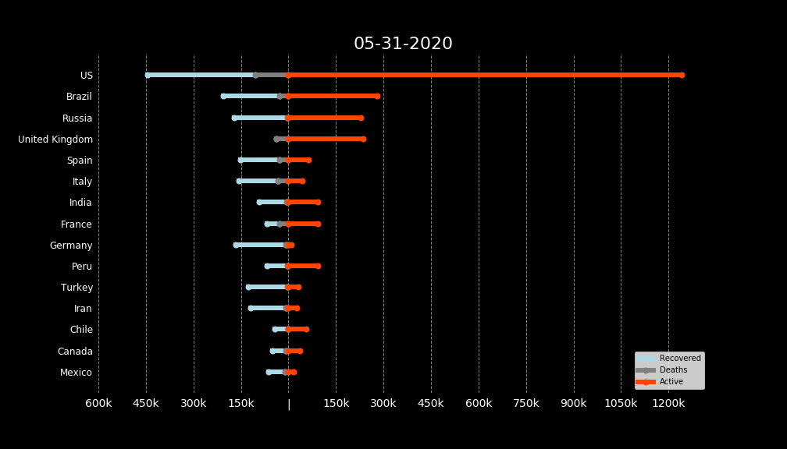
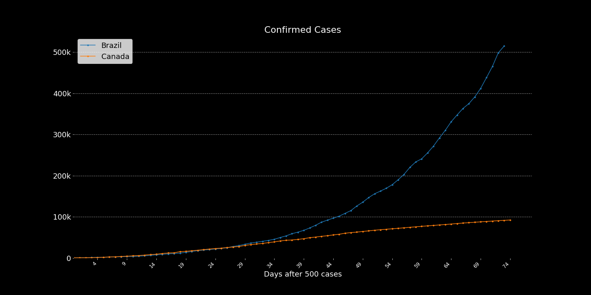
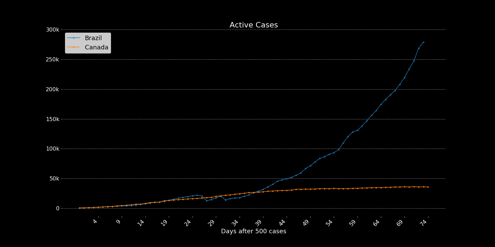
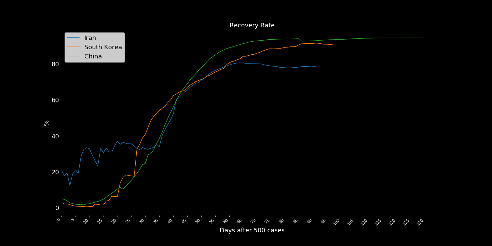
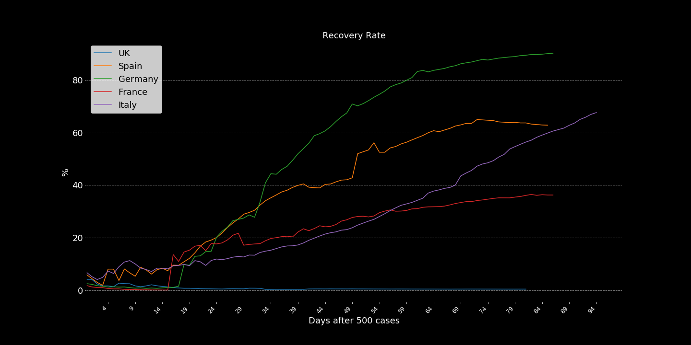
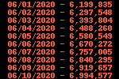
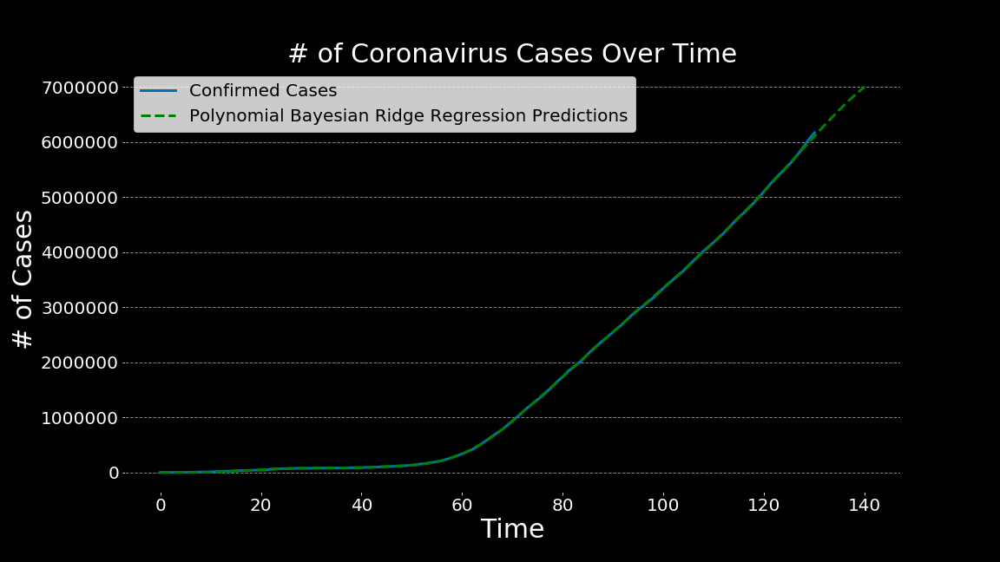
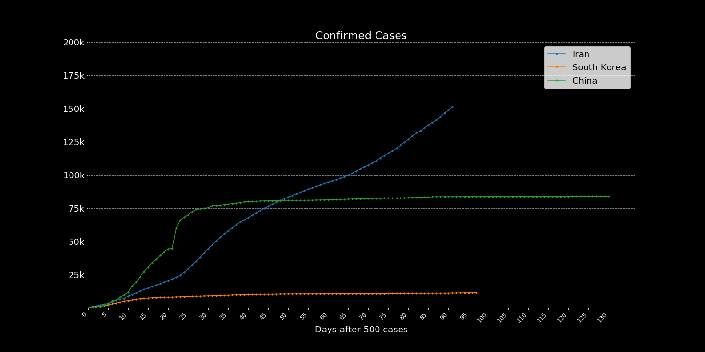

# Corona Virus Disease 2019
  
Referencing the **[Public Health Agency of Canada](https://www.canada.ca/en/public-health/services/diseases/2019-novel-coronavirus-infection/symptoms.html?topic=ex-col-faq#a)**:  
  
"About coronaviruses
Coronaviruses are a large family of viruses. Some cause illness in people and others cause illness in animals. Human coronaviruses are common and are typically associated with mild illnesses, similar to the common cold.
  
COVID-19 is a new disease that has not been previously identified in humans. Rarely, animal coronaviruses can infect people, and more rarely, these can then spread from person to person through close contact.
  
There have been 2 other specific coronaviruses that have spread from animals to humans and which have caused severe illness in humans. These are the:  
  
[Severe acute respiratory syndrome coronavirus (SARS CoV)](https://www.canada.ca/en/health-canada/services/health-concerns/diseases-conditions/sars-severe-acute-respiratory-syndrome.html)  
[Middle East respiratory syndrome coronavirus (MERS CoV)](https://www.canada.ca/en/public-health/services/diseases/middle-east-respiratory-syndrome-mers.html)  

## Objective

To report, analyze, visualize, and acquire knowledge of the current Corona Virus Disease 2019 (COVID-19).  

This is mostly to keep a personal record of what is going on, I'm trying to use data and visualizations to record my current perception of the pandemic. Please take in mind that those are my opinions, I've tried to source all my assumptions and views, but still, there are many ways of looking at the same data or the same reports, articles, news, etc...
  
# Overview  

   
[World Map - Time series/ Animated](img/map_timeseries.gif)  
  
  
[Confirmed Cases - Time series/ Animated](img/rank_timeseries.gif)  

# Understanding The Coronavirus Disease 2019  
  
    Other Names:
    * Coronavirus
    * COVID
    * 2019-nCoV acute respiratory disease
    * Novel coronavirus pneumonia
    * SARS-CoV-2

## Transmission
  
The transmission is still being studied but we already know some things about it. It spreads by droplets or direct contact, it has an incubation period of 2-14 days, and it's possible that asymptomatic carriers can transmit the virus.
[1](https://www.sciencedirect.com/science/article/pii/S0924857920300674) 

There are lots of talks around this topic and lots of misinformation too, talks about it being transmitted through 5g networks, or that if you eat or do something you won't get it, and so on.  
WHO has a section in their [website](https://www.who.int/emergencies/diseases/novel-coronavirus-2019/advice-for-public/myth-busters) to demystify those claims.  

## Confirmed Cases  

Total confirmed cases after 500 cases, Most affected countries:  
  
  
  
Brazil, Canada, and South Korea  
  
  
  
## Severity

COVID-19 patients most commonly display respiratory symptoms, the virus was firstly identified by an outbreak of pneumonia cases after all. But not only that, the disease has been proved to cause digestive symptoms, cardiovascular damage, neurological manifestations, and possible exposure to the liver. Most of those were only registered in a few cases, with even fewer cases developing symptoms hard enough to cause a fatality. [1](https://journals.lww.com/ajg/Documents/COVID_Digestive_Symptoms_AJG_Preproof.pdf), [2](https://www.nature.com/articles/s41569-020-0360-5?fbclid=IwAR3w4wcTno9A798v1fuYbALPLUHU5dNsVNVFKDc6GW-6yED2mXcyxrJY7dc), [3](https://papers.ssrn.com/sol3/papers.cfm?abstract_id=3544840), 
[4](https://www.thelancet.com/journals/langas/article/PIIS2468-1253(20)30057-1/fulltext)
  
 Mostly the fatalities are happening because of respiratory symptoms, with a higher probability of happening to patients in higher age or with pre-existing health conditions. [1](https://www.sciencedirect.com/science/article/pii/S0140673620305663), [2](https://www.youtube.com/watch?v=BuzP-uLctYE)

>The fact that many patients deteriorate to a critical state and require intensive care for significantly more than one week is particularly concerning. Basic epidemiological models of the spread of the SARS-CoV-2 virus suggest that owing to its contagiousness and the lack of immunity in the population, 40−70% of the population could become infected unless strong measures are taken. [Swiss Medical Weekly](https://smw.ch/article/doi/smw.2020.20225?fbclid=IwAR2MDart-7WJ1IotWGBszlmHl6JCSgqVQexw2iPqOlnMvZQ1XSpjsV1PNaY)

On top of all that, we are still trying to figure out much of the treatment, and the biggest issue with the disease is currently the speed it's spreading and our limited resources in terms of healthcare.
[1](https://youtu.be/bp5RMutCNoI)
  
## Mortality Rates
  
I want to make a note here about the mortality rates. In this analysis, I've used two methods to calculate the on-going mortality rate of the virus, but it's important to mention that both of them are extremely naive.

The [first way](https://www.worldometers.info/coronavirus/coronavirus-death-rate/#correct) is what most people are doing, simply calculating Deaths/Confirmed Cases and reporting the percentage of people that died from the disease compared to the number of confirmed cases, this is naive because it doesn't really consider the 'time'. Most of the confirmed cases are currently infections in process, that haven't concluded yet, so by considering them we are reducing the true mortality rate.  
  
The [other methods](https://academic.oup.com/aje/article/162/5/479/82647) I'm using is calculating Deaths/(Deaths+Recoveries), this way we're considering only cases that came to a conclusion. But again this is still incomplete since at the beginning of the pandemic the only cases reported were cases with very heavy symptoms and mostly in late stages of the infection. The number of deaths was reported way faster than the recoveries and we took a long time until we started looking at asymptomatic cases. So this number will usually display a higher mortality rate than the true.  
  
To make it simple, consider the first mortality rate you see as an underestimated number and the second as an overestimated number.   
  
China and the World:  
  
  
  
Most Affected:  
  
  
  
Brazil, Canada, and SK:  
  
  
  
_____

## Suppression and Mitigation

The impacts on our society will take decades to repair, deaths, traumas, low morale of citizens and a struggling economy are expected to follow the virus. To contain those we need to work on mitigation measures, those measures are being taken around the world in the most different shapes and forms, but what actually works in a situation like this?  

One thing is clear, doing nothing isn't helpful in anyways and will cause an even higher impact on the society and its economy.[1](https://www.thelancet.com/pdfs/journals/lancet/PIIS0140-6736(20)30567-5.pdf) 
  
>"Until an efficacious and safe vaccine becomes available − with even the most optimistic estimates putting this at 9 to 18 months − the only way to prevent the above scenario is to control the spread of SARS-CoV-2. While strict social distancing measures are necessary, nobody can imagine such measures being enforceable for extended periods of time" [Swiss Medical Weekly](https://smw.ch/article/doi/smw.2020.20225?fbclid=IwAR2MDart-7WJ1IotWGBszlmHl6JCSgqVQexw2iPqOlnMvZQ1XSpjsV1PNaY)  
  
The [Imperial College COVID-19 Response Team](https://spiral.imperial.ac.uk/bitstream/10044/1/77482/8/2020-03-16-COVID19-Report-9.pdf) has described a nice categorization of the measures taken by countries and regions, where they are either going for suppression or mitigation measures. Both solutions require extensive use of non-pharmaceutical interventions (NPIs), which comes to proper hygiene, social distancing, and others intended to reduce transmission.  

>**Suppression**. Here the aim is to reduce the reproduction number (the average number of secondary cases each case generates), R, to below 1 and hence to reduce case numbers to low levels or (as for SARS or Ebola) eliminate human-to-human transmission. The main challenge of this approach is that NPIs (and drugs, if available) need to be maintained – at least intermittently - for as long as the virus is circulating in the human population, or until a vaccine becomes available. In the case of COVID-19, it will be at least 12-18 months before a vaccine is available. Furthermore, there is no guarantee that initial vaccines will have high efficacy.

>**Mitigation**. Here the aim is to use NPIs (and vaccines or drugs, if available) not to interrupt transmission completely, but to reduce the health impact of an epidemic, akin to the strategy adopted by some US cities in 1918, and by the world more generally in the 1957, 1968 and 2009 influenza pandemics. In the 2009 pandemic, for instance, early supplies of vaccine were targeted at individuals with pre-existing medical conditions which put them at risk of more severe disease. In this scenario, population immunity builds up through the epidemic, leading to an eventual rapid decline in case numbers and transmission dropping to low levels.  
  
Both paths will lead to tremendous losses, by the actions we're watching from other countries we can note that mitigation measures only work with a highly efficient structure and when adopted in the early stages of the contamination, those were seen in South Korea, Taiwan, and Singapore. While some countries failed to maintain mitigation measures such as the UK, others barely had time to it such as Italy, France, and Spain. Those countries that couldn't handle the situation with mitigation measures quickly pursued suppression measures, with tighter restrictions on the population and limitations to movement, commerce, and production of "non-essential" goods.  
  
**Italy** is trying to contain the outbreak with wide suppression measures:  
  
  
Methods such as **case isolation and contact tracing** can be very helpful, especially if done at the start of the spread, but as the infection goes undetected it's harder to contain it through contact tracing. [1](https://www.sciencedirect.com/science/article/pii/S2214109X20300747)
  
**South Korea** is containing the infections with targeted and clustered isolations, lots of testing, social distancing, and NPIs.  
  
  
Some even more expensive measures such as testing a local population and isolating asymptomatic cases were already tested and also proved to be helpful in containing the virus. Unfortunately, the resources needed to provide such an amount of testing may be too far from reality to many places.    
  
>In an open letter to the authorities in the Tuscany region,1 Romagnani wrote that the great majority of people infected with COVID-19—50-75%—were asymptomatic, but represented “a formidable source” of contagion. [The BMJ](https://www.regenhealthsolutions.info/wp-content/uploads/2020/04/Covid-19-identifying-and-isolating-asymptomatic.pdf)

Another very difficult decision when working with targeted isolation or any other kind of isolation is when to stop? Since there isn't a single test reliable enough to decide on de-isolation many factors need to be considered, those can be made even harder when we account for asymptomatic cases, dual infections, and other issues imposed by the scalability of collecting those indicators.  
  
>"No single indicator may be effectively used to decide on de-isolation of a suspect case. In our series of positive cases, samples from one suspect case only returned positive on the fifth repeated sample (nasopharyngeal swab), on the seventh day of clinical illness. Current evidence suggests that transmission of COVID-19 may be possible even from asymptomatic contacts, and polymerase chain reaction (PCR) testing may not return positive initially." [National Centre for Infectious
Diseases - Singapore](https://www.med.uminho.pt/pt/covid19/Sade%20Pblica/Tay-2020-De-isolating%20COVID-19%20Suspect%20Cases_.pdf)
  
**World-wide** lockdown measures, inspired by [this](https://www.businessinsider.com/countries-on-lockdown-coronavirus-italy-2020-3#china-implemented-what-was-then-the-largest-quarantine-in-human-history-to-try-to-contain-the-coronavirus-locking-down-at-least-16-cities-at-the-end-of-january-14) Business Insider article  
  
  
**Fiscal Responses** taken by some major economies, according to [Bruegel](https://www.bruegel.org/publications/datasets/covid-national-dataset/):  
  

_____
# Regressions

Those regressions are based on the work compiled by [Xingyu Bian](https://www.kaggle.com/therealcyberlord/coronavirus-covid-19-visualization-prediction).  
  
It's important to make a few notes about regressions and predictions at this time, those numbers are for illustration and research only and should never replace any kind of medical or governmental information you may receive. It's also important to note that the veracity of the analyzed data is questionable so predictions may have a huge distortion when compared to reality.
  
**SVM - Support Vector Machine Regressor:**  
  
  
  
**Polynomial Regression:**  
  
  
  
**Polynomial Baysian Ridge Regression:**  
  
  
  
_____
# Patients Info 

Three small samples of patients were used for building the following visualizations. [1](https://www.kaggle.com/kimjihoo/coronavirusdataset), [2](https://www.kaggle.com/roche-data-science-coalition/uncover), [3](https://github.com/ishaberry/Covid19Canada).  
It's Important to mention the results displayed by those distributions depend on many factors, and this distribution only represents a random sample of patients at random times and hospitals. Things like the kind of treatment, age, pre-existing health conditions, and many others will directly affect those numbers. So by any means, this should be considered current or accurate.  
  

Age Distribution - All Patients  
  
  
Age Distribution - Released Patients  
  
  
Histogram of patients by days until release  
(days between confirmed case and release)  
  
    

Histogram of patients by days until fatality  
(days between the confirmed case and deceased date)  

  
_____

# Personal Notes on Countries

**China** is the epicenter of the disease, where it originated and started spreading. It has been keeping a very bad record of the epidemic, with [misleading data](https://www.forbes.com/sites/kenrapoza/2020/03/31/china-hints-that-its-coronavirus-data-doesnt-paint-full-picture/#59d700422d58), reluctancy to accept the situation and [poor handling of the medical team](https://www.theguardian.com/world/2020/mar/11/coronavirus-wuhan-doctor-ai-fen-speaks-out-against-authorities) that both discovered and are treating the pandemic. In addition to that, at the start of the pandemic [WHO supported China](https://nationalpost.com/news/world/this-is-not-a-time-for-fear-who-downplays-criticism-china-hushed-up-coronavirus-in-early-days) to [hide the actual numbers](https://www.cnbc.com/2020/04/01/coronavirus-china-hid-extent-of-outbreak-us-intelligence-reportedly-says.html?view=story) and [misdirect world efforts](https://www.youtube.com/watch?v=m5fsidSOJMw) by [ensuring other nations](https://www.youtube.com/watch?v=LwqhvRcBrK4) that China was doing a great job containing the virus. This series of misleading actions and [grave mistakes](https://www.youtube.com/watch?v=U-746eJGyUI&feature=youtu.be) led to the second extremely hit country, Italy.  
  
  
  
[Late Asymptomatic Cases Reporting](https://www.cnn.com/2020/03/31/asia/china-asymptomatic-coronavirus-cases/index.html)  
  
Total confirmed cases after 500 cases, China:  
  
  
After all those issues and due the situation we are now, it's clear that the World Health Organization shouldn't be so [politized](https://www.youtube.com/watch?v=UlCYFh8U2xM).

**Italy** is the second country to have extremely high numbers of infections, it started after China's lockdown and quarantine procedures while WHO was telling the situation was under control. Since they were the first country to be heavily hit after China, their [healthcare system couldn't handle the situation](https://www.youtube.com/watch?v=z2KpsZRpoZ8) and was quickly overwhelmed by cases. Italy is, for now, the country with the most registered casualties and motivated most of the world to act in preparation for the COVID-19 pandemic.  
  
Infections, recoveries, deceased, and testing numbers by region:  
  
*Note that the time for concluding a test and receiving its results may vary, so the results showed in one day correspond to tests made earlier and not necessarily on that same day.  
  
  
  
**United States** is currently the country with most cases, it started to accumulate cases really soon, but only recognized the problem on the late march when the many epidemics spread trought the country couldn't be contained anymore. Most of the mistakes the US committed were due to poor leadership and denialism of what was happening. Apparently they recently realized the impacts this crisis will bring to the economy and began to heavily test and prepare for the ongoing crisis.  
  
[Trump Tweet](https://i.imgur.com/e6JNRGi.png)  
[Trump on COVID-19](https://twitter.com/i/status/1242193904553865216)  
[NY - End of March](https://www.youtube.com/watch?v=bE68xVXf8Kw)  
[U.S. reluctant to call national lockdown](https://youtu.be/L1XIXssA1xg)  
  
**Spain** was heavily hit with the virus shortly after Italy, they are currently the third country with most cases of the disease and the second country with the most fatalities. They have been struggling with resource shortages, and the overflow of infected patients have [reportedly](https://www.youtube.com/watch?v=i4DngwmTzIA) overwhelmed their systems.  
  
**Germany** apparently has been [handling well](https://www.youtube.com/watch?v=TC8wxecpcfk) the situation, they started to the crisis with very high amounts of testings and even though this made their numbers increase quite fast they're apparently aware of the situation and are being able to maintain a very low mortality rate. They are also the only country I've heard so far to be helping other EU countries with not only resources but also taking [patients for treatment](https://www.foxnews.com/world/germany-takes-coronavirus-patients-from-italy).  
  
**France** has suffered a lot with the pandemic already, just like Italy and South Korea they were one of the first countries to be infected and due to poor preparation and a [delay in taking actions](https://www.thelancet.com/journals/lanpub/article/PIIS2468-2667(20)30087-6/fulltext) against the contamination they've seen huge numbers of infected with high mortality rates.  
  
**Canada**  is treating the pandemic very seriously since the beginning, it's response has shown a good detection rate (testing/ confirmed), a notable amount of recoveries, and good public cooperation. Even though the size of the crisis and it's responses are different in every province the country has overall shown a [single direction](https://www.youtube.com/watch?v=q2vsNuZ4_Zg) in matters of dealing with the virus.  

Cases overview:  
  
  
  
  
_British Columbia:_  

  
  
BC, Population Distribution by Age:  
  

**South Korea** is an example of how to [properly deal](https://external-preview.redd.it/0rInwaK8upOHByAw_vSrRzdbddmOHwIfZcPmFkLMdIw.jpg?width=640&crop=smart&auto=webp&s=f6413e0eefe6f58f564261d05c56cddea44f10fe) with the epidemic and has a [great record](https://www.youtube.com/watch?v=BE-cA4UK07c&feature=youtu.be) of the transparent release of data and information.  
  
**Brazil** which is my home country and apparently is about to become some kind of control group for a very bizarre experiment. Their position has been unclear since [the president is still dismissing](https://www.nytimes.com/2020/04/01/world/americas/brazil-bolsonaro-coronavirus.html) the pandemic but other political leaders are not, Brazil also has issues within its data collection, mostly for lack of testing so the information is not completely trustworthy.  

[Homeless People Risks](https://www.youtube.com/watch?v=IbgUe-YmM-E)
  
**Iran** has also went in a denialist path, it tried to change the narrative but still is having lots of problems involving religious and scientific conflicts inflated by misinformation campaigns during the pandemic.  
  
[CBC Coverage](https://www.youtube.com/watch?v=_4Bt29_-oFw)  
[NY Times Coverage](https://www.youtube.com/watch?v=lm2UFynetJw)  
  
**United Kingdom** was reluctant to start preparations and enforce containment measures at the beginning of the crisis, they considered [herd-immunity](https://www.youtube.com/watch?v=hJBTV8anp-8) as an option but eventually recognized their mistakes and started a [nationwide lockdown](https://www.youtube.com/watch?v=LlJIwTd9fqI) 4 days before announcing the [PM has tested positive](https://www.cbc.ca/news/world/britain-pm-johnson-covid-19-1.5512020) for the virus. Their current situation is not good, they had also experienced a lack of resources, more specifically of [tests](https://www.youtube.com/watch?v=96_4FfXA94c).  
  
**Cuba** is being extremely helpful to many different nations, instead of sending resources such as masks and ventilators, or picking patients from overwhelmed countries Cuba is [sending doctors](https://apnews.com/98cfdbf5c4a62a40eba648723e452f3e).  
  
_____
# References, resources, and inspirations.  
    
[Daily Cases and Reports - by Johns Hopkins CSSE](https://github.com/CSSEGISandData/COVID-19)  
[CBC News Articles Dataset](https://www.kaggle.com/ryanxjhan/cbc-news-coronavirus-articles-march-26)  
[Data Science for Covid-19 - South Korea Data](https://www.kaggle.com/kimjihoo/coronavirusdataset)  
[Covid19 - Canada](https://github.com/ishaberry/Covid19Canada)  
[Daily Cases Report](https://www.kaggle.com/imdevskp/corona-virus-report)  
[World Bank - Health Systems](https://www.kaggle.com/danevans/world-bank-wdi-212-health-systems)  
[Roche DS Coalition - Uncover Challange](https://www.kaggle.com/roche-data-science-coalition/uncover#public-covid-19-cases-canada.csv)  
Forecast competition [w1](https://www.kaggle.com/c/covid19-global-forecasting-week-1), [w2](https://www.kaggle.com/c/covid19-global-forecasting-week-2)  
[Research Papers](https://www.kaggle.com/allen-institute-for-ai/CORD-19-research-challenge/)  
[Italy Cases](https://www.kaggle.com/sudalairajkumar/covid19-in-italy)  
[Wellcome Survey (2018)](https://wellcome.ac.uk/reports/wellcome-global-monitor/2018)  
[CBC article on data sharing](https://www.cbc.ca/news/canada/coronavirus-date-information-sharing-1.5500709)  
[Singapore Dashboard](https://co.vid19.sg/singapore/dashboard)  
[Canada Dashboard](https://resources-covid19canada.hub.arcgis.com/)    
[The international journal of science / 19 March 2020](https://media.nature.com/original/magazine-assets/d41586-020-00772-4/d41586-020-00772-4.pdf)  
[Economics in the Time of COVID-19](http://viet-studies.net/kinhte/COVID19_CPER.pdf), edited by Richard Baldwin and Beatrice Weder di Mauro.  
[Economic Strategy Group Statement - COVID-19](https://economicstrategygroup.org/resource/economic-strategy-group-statement-covid19/)  
[Fiscal response to the economic fallout](https://www.bruegel.org/publications/datasets/covid-national-dataset/)

Video Resources:  
[Cambridge University: Spanish Flu: a warning from history - 2018](https://www.youtube.com/watch?v=3x1aLAw_xkY)  
[Cambridge University: Coronavirus Vaccine](https://youtu.be/UPkVbZ9X_jQ)  
[Bill Gates: TED Talk, Next Outbreak - 2015](https://www.youtube.com/watch?v=6Af6b_wyiwI)  
[Global Economy Impact - Al Jazeera](https://www.youtube.com/watch?v=94wGHRDHyHo)  
  
### More Info About this Project:
For now, I'm just collecting and analyzing data. As things are way too fast I'm not properly documenting my code, but I do plan to return and fix this :)
