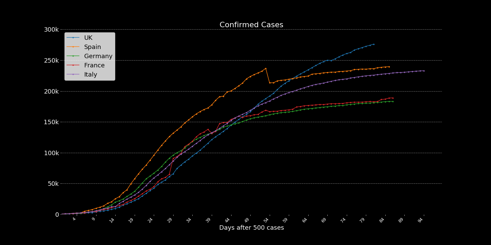
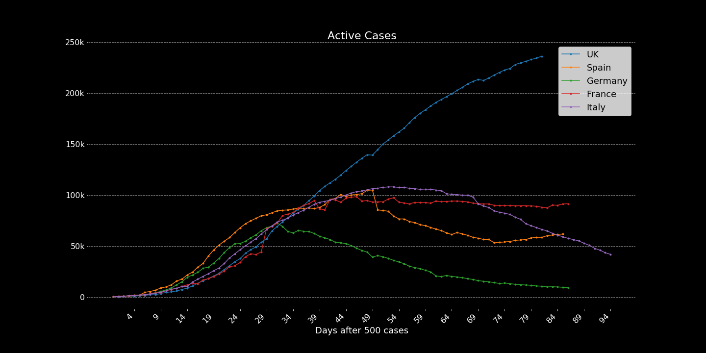
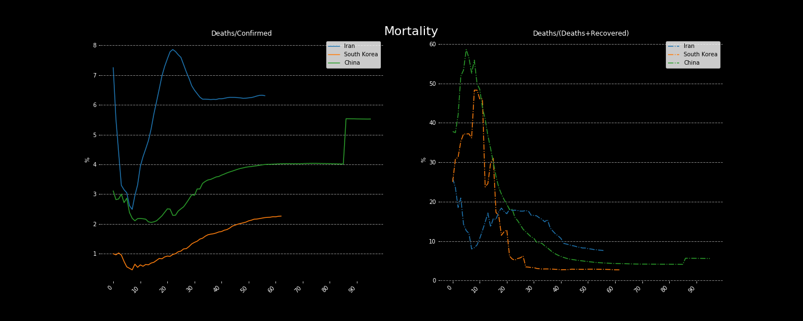
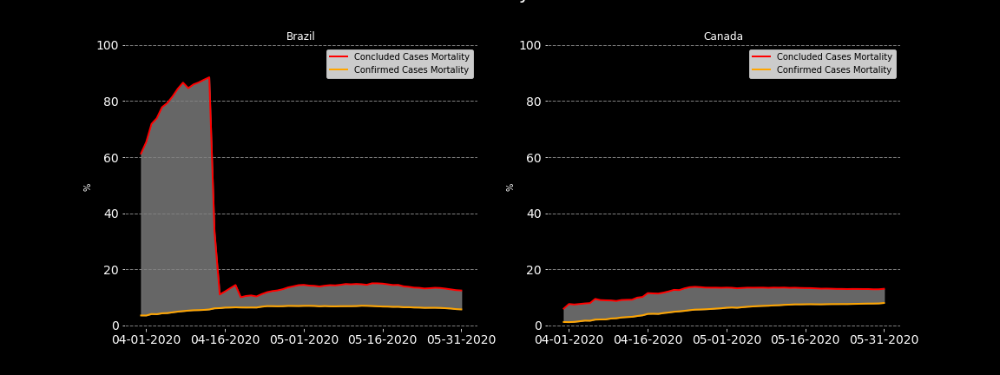
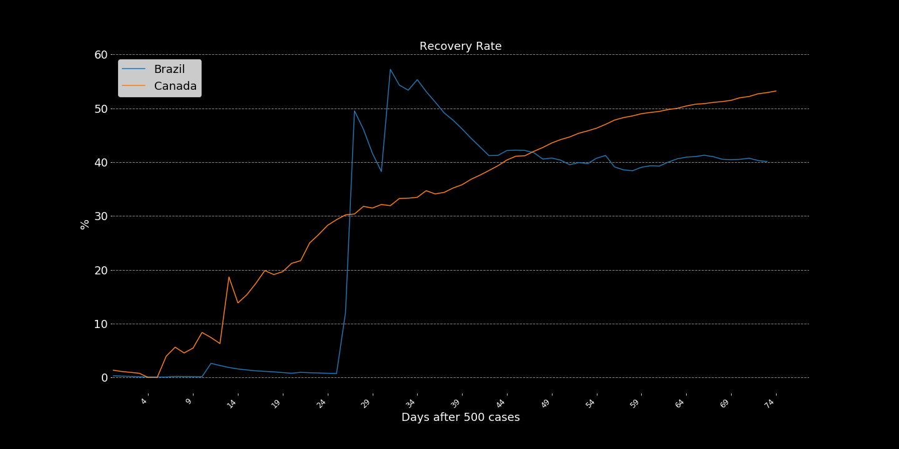
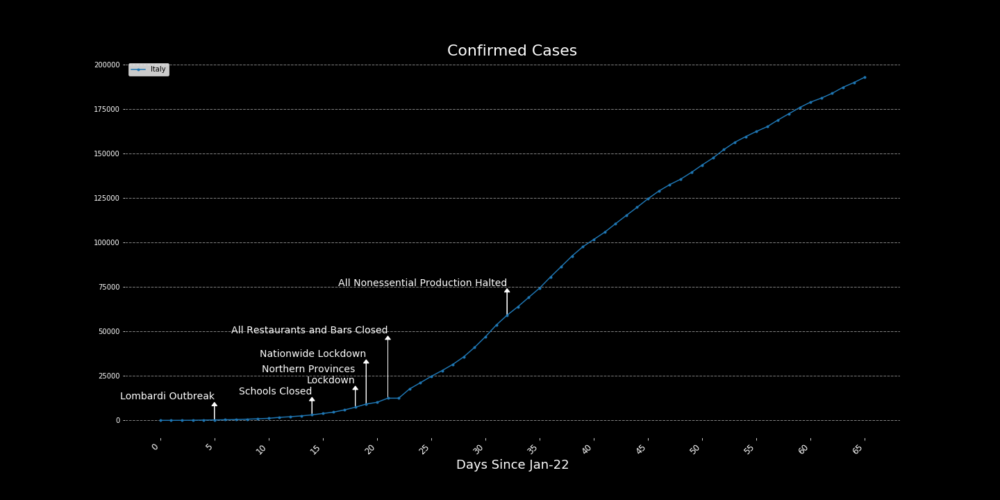
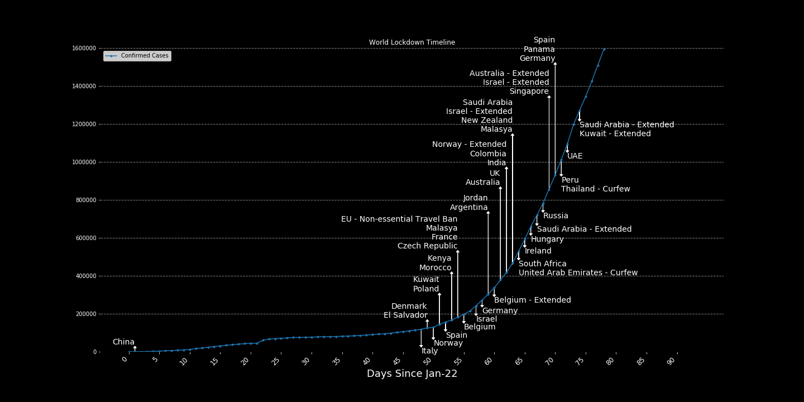
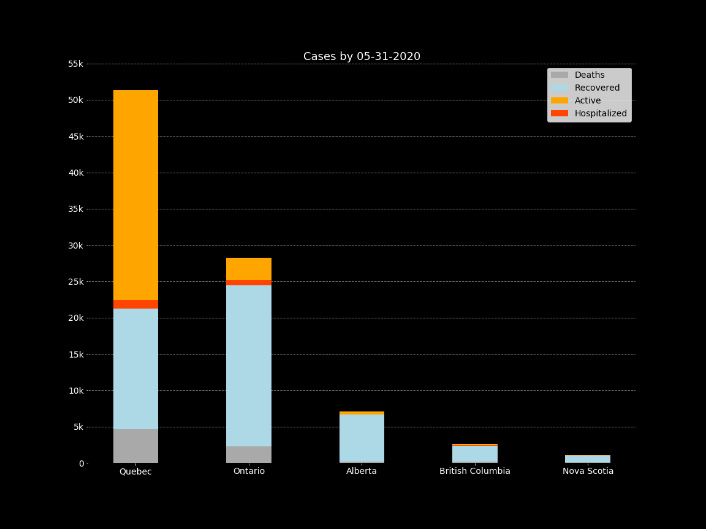
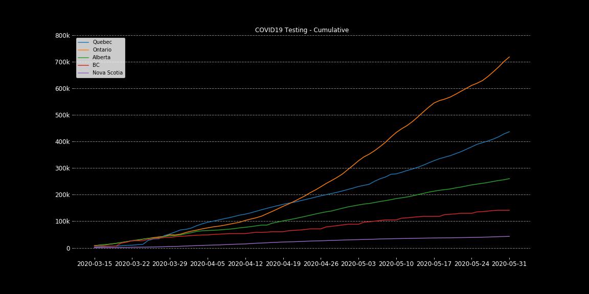

# Corona Virus Disease 2019
  
Referencing the **[Public Health Agency of Canada](https://www.canada.ca/en/public-health/services/diseases/2019-novel-coronavirus-infection/symptoms.html?topic=ex-col-faq#a)**:  
  
"About coronaviruses
Coronaviruses are a large family of viruses. Some cause illness in people and others cause illness in animals. Human coronaviruses are common and are typically associated with mild illnesses, similar to the common cold.
  
COVID-19 is a new disease that has not been previously identified in humans. Rarely, animal coronaviruses can infect people, and more rarely, these can then spread from person to person through close contact.
  
There have been 2 other specific coronaviruses that have spread from animals to humans and which have caused severe illness in humans. These are the:  
  
[Severe acute respiratory syndrome coronavirus (SARS CoV)](https://www.canada.ca/en/health-canada/services/health-concerns/diseases-conditions/sars-severe-acute-respiratory-syndrome.html)  
[Middle East respiratory syndrome coronavirus (MERS CoV)](https://www.canada.ca/en/public-health/services/diseases/middle-east-respiratory-syndrome-mers.html)  

## Objective

To report, analyze, visualize, and acquire knowledge of the current Corona Virus Disease 2019 (COVID-19).  

This is mostly to keep a personal record of what is going on, I'm trying to use data and visualizations to record my current perception of the pandemic. Please take in mind that those are my opinions, I've tried to source all my assumptions and views, but still, there are many ways of looking at the same data or the same reports, articles, news, etc...
  
# Overview  
  
  
  
  
  
  
  
# Confirmed Cases  

Total confirmed cases after 500 cases, Most affected countries:  
  
  
  
Brazil, Canada, and South Korea  
  
  
  
## Mortality Rates
  
I want to make a note here about the mortality rates. In this analysis, I've used two methods to calculate the on-going mortality rate of the virus, but it's important to mention that both of them are extremely naive.

The [first way](https://www.worldometers.info/coronavirus/coronavirus-death-rate/#correct) is what most people are doing, simply calculating Deaths/Confirmed Cases and reporting the percentage of people that died from the disease compared to the number of confirmed cases, this is naive because it doesn't really consider the 'time'. Most of the confirmed cases are currently infections in process, that haven't concluded yet, so by considering them we are reducing the true mortality rate.  
  
The [other methods](https://academic.oup.com/aje/article/162/5/479/82647) I'm using is calculating Deaths/(Deaths+Recoveries), this way we're considering only cases that came to a conclusion. But again this is still incomplete since at the beginning of the pandemic the only cases reported were cases with very heavy symptoms and mostly in late stages of the infection. The number of deaths was reported way faster than the recoveries and we took a long time until we started looking at asymptomatic cases. So this number will usually display a higher mortality rate than the true.  
  
To make it simple, consider the first mortality rate you see as an underestimated number and the second as an overestimated number.   
  
China and the World:  
  
  
  
Most Affected:  
  
  
  
Brazil, Canada, and SK:  
  
  
  
_____
# Timelines

Some timelines of the measures taken to contain the infections.  
  
**Italy** tried to contain the outbreak with wide isolation measures:  
  
  
**South Korea** is containing the infections with targeted and clustered isolations and lots of testing.  

  
**World-wide** lockdown measures, inspired by [this](https://www.businessinsider.com/countries-on-lockdown-coronavirus-italy-2020-3#china-implemented-what-was-then-the-largest-quarantine-in-human-history-to-try-to-contain-the-coronavirus-locking-down-at-least-16-cities-at-the-end-of-january-14) Business Insider article  
  
  
_____
# Regressions

Those regressions are based on the work compiled by [Xingyu Bian](https://www.kaggle.com/therealcyberlord/coronavirus-covid-19-visualization-prediction).  
  
It's important to make a few notes about regressions and predictions at this time, those numbers are for illustration and research only and should never replace any kind of medical or governmental information you may receive. It's also important to note that the veracity of the analyzed data is questionable so predictions may have a huge distortion when compared to reality.
  
**SVM - Support Vector Machine Regressor:**  
  
  
  
**Polynomial Regression:**  

  
**Polynomial Baysian Ridge Regression:**  
  
  
  
_____
# Patients Info 

Based on a sample of [South Korea Cases](https://www.kaggle.com/kimjihoo/coronavirusdataset) - (Blue), and a sample of [Canada Cases](https://www.kaggle.com/roche-data-science-coalition/uncover), [More Canada](https://github.com/ishaberry/Covid19Canada) - (Orange Red)  
  
Age Distribution - All Patients  
   
Age Distribution - Released Patients  
  
Age Distribution - Deceased Patients  
  
  
Histogram of patients by days until release  
(days between confirmed case and release)  
  
    

Histogram of patients by days until fatality  
(days between the confirmed case and deceased date)  

  

_____

# CBC News Articles
An analysis of over [3,500 CBC articles](https://www.kaggle.com/ryanxjhan/cbc-news-coronavirus-articles-march-26) about the COVID-19 pandemic.  
  
Most mentioned words in the titles:  

  
I've used VADER to analyze the sentiment polarity of those articles, it uses a dictionary to assign scores to the words while considering their location within the text, punctuations, and other grammatical variables to score the document with a proportion of each sentiment polarity contained on it. Those polarities are classified as negative, positive and neutral.  
  

  
The values of the polarity score are more spread through time, but we can look even closer to those scores.  

Non-neutral scores - Weekly:  
  
  
Now we can start to see a trend of more positive articles. To extrapolate on that we can normalize the scores within the weeks and have a better look at how they compare against each other.  
  
Normalized non-neutral scores - Weekly:  
  
  
_____
# Restaurant Reservations

Year over year change in restaurant reservations, [data from OpenTable](https://www.kaggle.com/roche-data-science-coalition/uncover) 

  
_____
# Wellcome Survey - Science Perception
  
The [wellcome global monitor survey](https://wellcome.ac.uk/reports/wellcome-global-monitor/2018) has some very interesting data on public perception over science, medicine, government, and many other topics.
  
Those can be used to understand policies, public responses, and other aspects of the crisis. * Data from 2018

Some examples:  
  
  
  
  
  
  
_____

# Personal Notes on Countries

**China** is the epicenter of the disease, where it originated and started spreading. It has been keeping a very bad record of the epidemic, with [misleading data](https://www.forbes.com/sites/kenrapoza/2020/03/31/china-hints-that-its-coronavirus-data-doesnt-paint-full-picture/#59d700422d58), reluctancy to accept the situation and [poor handling of the medical team](https://www.theguardian.com/world/2020/mar/11/coronavirus-wuhan-doctor-ai-fen-speaks-out-against-authorities) that both discovered and are treating the pandemic. In addition to that, at the start of the pandemic [WHO supported China](https://nationalpost.com/news/world/this-is-not-a-time-for-fear-who-downplays-criticism-china-hushed-up-coronavirus-in-early-days) to [hide the actual numbers](https://www.cnbc.com/2020/04/01/coronavirus-china-hid-extent-of-outbreak-us-intelligence-reportedly-says.html?view=story) and [misdirect world efforts](https://www.youtube.com/watch?v=m5fsidSOJMw) by ensuring other nations that China was doing a great job containing the virus. This series of misleading actions and grave mistakes led to the second extremely hit country, Italy.  
  
  
  
[Late Asymptomatic Cases Reporting](https://www.cnn.com/2020/03/31/asia/china-asymptomatic-coronavirus-cases/index.html)  
  
Total confirmed cases after 500 cases, China:  
  
  
**Italy** is the second country to have extremely high numbers of infections, it started after China's lockdown and quarantine procedures while WHO was telling the situation was under control. Since they were the first country to be heavily hit after China, their [healthcare system couldn't handle the situation](https://www.youtube.com/watch?v=z2KpsZRpoZ8) and was quickly overwhelmed by cases. Italy is, for now, the country with the most registered casualties and motivated most of the world to act in preparation for the COVID-19 pandemic.  
  
Infections, recoveries, deceased, and testing numbers by region:  
  
*Note that the time for concluding a test and receiving its results may vary, so the results showed in one day correspond to tests made earlier and not necessarily on that same day.  
  
  
  
**United States** is currently the country with most cases, it started to accumulate cases really soon, but only recognized the problem on the late march when the many epidemics spread trought the country couldn't be contained anymore. Most of the mistakes the US committed were due to poor leadership and denialism of what was happening. Apparently they recently realized the impacts this crisis will bring to the economy and began to heavily test and prepare for the ongoing crisis.  
  
[Trump Tweet](https://i.imgur.com/e6JNRGi.png)  
[Trump on COVID-19](https://twitter.com/i/status/1242193904553865216)  
[NY - End of March](https://www.youtube.com/watch?v=bE68xVXf8Kw)  
[U.S. reluctant to call national lockdown](https://youtu.be/L1XIXssA1xg)  
  
**Spain** was heavily hit with the virus shortly after Italy, they are currently the third country with most cases of the disease and the second country with the most fatalities. They have been struggling with resource shortages, and the overflow of infected patients have [reportedly](https://www.youtube.com/watch?v=i4DngwmTzIA) overwhelmed their systems.  
  
**Germany** apparently has been [handling well](https://www.youtube.com/watch?v=TC8wxecpcfk) the situation, they started to the crisis with very high amounts of testings and even though this made their numbers increase quite fast they're apparently aware of the situation and are being able to maintain a very low mortality rate. They are also the only country I've heard so far to be helping other EU countries with not only resources but also taking [patients for treatment](https://www.foxnews.com/world/germany-takes-coronavirus-patients-from-italy).  
  
**France** has suffered a lot with the pandemic already, just like Italy and South Korea they were one of the first countries to be infected and due to poor preparation and a [delay in taking actions](https://www.thelancet.com/journals/lanpub/article/PIIS2468-2667(20)30087-6/fulltext) against the contamination they've seen huge numbers of infected with high mortality rates.  
  
**Canada**  is treating the pandemic very seriously since the beginning, it's response has shown a good detection rate (testing/ confirmed), a notable amount of recoveries, and good public cooperation. Even though the size of the crisis and it's responses are different in every province the country has overall shown a [single direction](https://www.youtube.com/watch?v=q2vsNuZ4_Zg) in matters of dealing with the virus.  

Cases overview:  
  
  
  
  
**South Korea** is an example of how to [properly deal](https://external-preview.redd.it/0rInwaK8upOHByAw_vSrRzdbddmOHwIfZcPmFkLMdIw.jpg?width=640&crop=smart&auto=webp&s=f6413e0eefe6f58f564261d05c56cddea44f10fe) with the epidemic and has a [great record](https://www.youtube.com/watch?v=BE-cA4UK07c&feature=youtu.be) of transparent release of data and information.  
  
**Brazil** which is my home country and apparently is about to become some kind of control group for a very bizarre experiment. Their position has been unclear since [the president is still dismissing](https://www.nytimes.com/2020/04/01/world/americas/brazil-bolsonaro-coronavirus.html) the pandemic but other political leaders are not, Brazil also has issues within its data collection, mostly for lack of testing so the information is not completely trustworthy.  

[Homeless People Risks](https://www.youtube.com/watch?v=IbgUe-YmM-E)
  
**Iran** has also went in a denialist path, it tried to change the narrative but still is having lots of problems involving religious and scientific conflicts inflated by misinformation campaigns during the pandemic.  
  
[CBC Coverage](https://www.youtube.com/watch?v=_4Bt29_-oFw)  
[NY Times Coverage](https://www.youtube.com/watch?v=lm2UFynetJw)  
  
**United Kingdom** was reluctant to start preparations and enforce containment measures at the beginning of the crisis, they considered [herd-immunity](https://www.youtube.com/watch?v=hJBTV8anp-8) as an option but eventually recognized their mistakes and started a [nationwide lockdown](https://www.youtube.com/watch?v=LlJIwTd9fqI) 4 days before announcing the [PM has tested positive](https://www.cbc.ca/news/world/britain-pm-johnson-covid-19-1.5512020) for the virus. Their current situation is not good, they had also experienced a lack of resources, more specifically of [tests](https://www.youtube.com/watch?v=96_4FfXA94c).  
  
**Cuba** is being extremely helpful to many different nations, instead of sending resources such as masks and ventilators, or picking patients from overwhelmed countries Cuba is [sending doctors](https://apnews.com/98cfdbf5c4a62a40eba648723e452f3e).  
  
_____
# References, resources, and inspirations.  
    
[Daily Cases and Reports - by Johns Hopkins CSSE](https://github.com/CSSEGISandData/COVID-19)  
[CBC News Articles Dataset](https://www.kaggle.com/ryanxjhan/cbc-news-coronavirus-articles-march-26)  
[Data Science for Covid-19 - South Korea Data](https://www.kaggle.com/kimjihoo/coronavirusdataset)  
[Covid19 - Canada](https://github.com/ishaberry/Covid19Canada)  
[Daily Cases Report](https://www.kaggle.com/imdevskp/corona-virus-report)  
[World Bank - Health Systems](https://www.kaggle.com/danevans/world-bank-wdi-212-health-systems)  
[Roche DS Coalition - Uncover Challange](https://www.kaggle.com/roche-data-science-coalition/uncover#public-covid-19-cases-canada.csv)  
Forecast competition [w1](https://www.kaggle.com/c/covid19-global-forecasting-week-1), [w2](https://www.kaggle.com/c/covid19-global-forecasting-week-2)  
[Research Papers](https://www.kaggle.com/allen-institute-for-ai/CORD-19-research-challenge/)  
[Italy Cases](https://www.kaggle.com/sudalairajkumar/covid19-in-italy)  
[Wellcome Survey (2018)](https://wellcome.ac.uk/reports/wellcome-global-monitor/2018)  
[CBC article on data sharing](https://www.cbc.ca/news/canada/coronavirus-date-information-sharing-1.5500709)  
[Singapore Dashboard](https://co.vid19.sg/singapore/dashboard)  
[Canada Dashboard](https://resources-covid19canada.hub.arcgis.com/)    
[The international journal of science / 19 March 2020](https://media.nature.com/original/magazine-assets/d41586-020-00772-4/d41586-020-00772-4.pdf)  
[Economics in the Time of COVID-19](http://viet-studies.net/kinhte/COVID19_CPER.pdf), edited by Richard Baldwin and Beatrice Weder di Mauro.  
[Economic Strategy Group Statement - COVID-19](https://economicstrategygroup.org/resource/economic-strategy-group-statement-covid19/)  
  
Video Resources:  
[Cambridge University: Spanish Flu: a warning from history - 2018](https://www.youtube.com/watch?v=3x1aLAw_xkY)  
[Cambridge University: Coronavirus Vaccine](https://youtu.be/UPkVbZ9X_jQ)  
[Bill Gates: TED Talk, Next Outbreak - 2015](https://www.youtube.com/watch?v=6Af6b_wyiwI)  
[Global Economy Impact - Al Jazeera](https://www.youtube.com/watch?v=94wGHRDHyHo)  
  
### More Info About this Project:
For now, I'm just collecting and analyzing data. As things are way too fast I'm not properly documenting my code, but I do plan to return and fix this :)
