# Corona Virus Disease 2019
  
Referencing the **[Public Health Agency of Canada](https://www.canada.ca/en/public-health/services/diseases/2019-novel-coronavirus-infection/symptoms.html?topic=ex-col-faq#a)**:  
  
"Coronaviruses are a large family of viruses. Some cause illness in people, and others cause illness in animals. Human coronaviruses are common and are typically associated with mild diseases, similar to the common cold.
  
COVID-19 is a new disease that has not been previously identified in humans. Rarely, animal coronaviruses can infect people, and more rarely, these can then spread from person to person through close contact.
  
There have been 2 other specific coronaviruses that have spread from animals to humans and which have caused severe illness in humans. These are the:  
  
[Severe acute respiratory syndrome coronavirus (SARS CoV)](https://www.canada.ca/en/health-canada/services/health-concerns/diseases-conditions/sars-severe-acute-respiratory-syndrome.html)  
[Middle East respiratory syndrome coronavirus (MERS CoV)](https://www.canada.ca/en/public-health/services/diseases/middle-east-respiratory-syndrome-mers.html)"  

## Objective

To report, analyze, visualize, and acquire knowledge of the current Corona Virus Disease 2019 (COVID-19).  

This project is mostly to keep a personal record of what is going on. I'm trying to use data and visualizations to record my current perception of the pandemic. Please take in mind that those are my opinions, I've been attempting to source all my assumptions and views, but still, there are many ways of looking at the same data or the same reports, articles, news, etc.
  
# Overview  
  
  
  
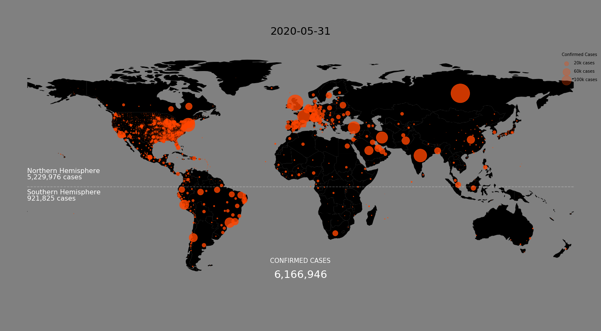   
[World Map - Time series/ Animated](img/map_timeseries.gif)  
  
  
[Confirmed Cases - Time series/ Animated](img/rank_timeseries.gif)  

# Understanding The Coronavirus Disease 2019  
  
    Other Names:
    * Coronavirus
    * COVID
    * 2019-nCoV acute respiratory disease
    * Novel coronavirus pneumonia
    * SARS-CoV-2

## Transmission
  
The transmission is still being studied, but we already know some things about it. It spreads by droplets or direct contact, it has an incubation period of 2-14 days, and there's a possibility of asymptomatic patients transmitting the virus.
[1](https://www.sciencedirect.com/science/article/pii/S0924857920300674) 

There are lots of talks around this topic and lots of misinformation too, talks about 5g networks transmitting, or that if you eat or do something, you won't get it, and so on.  
WHO has a section in their [website](https://www.who.int/emergencies/diseases/novel-coronavirus-2019/advice-for-public/myth-busters) to demystify those claims.  

### Confirmed Cases  

**U.S. and the World:**  
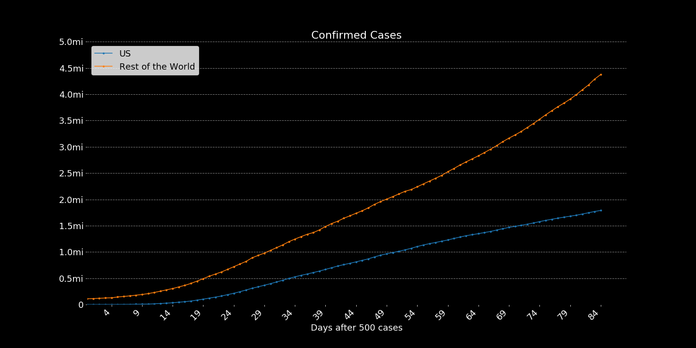  
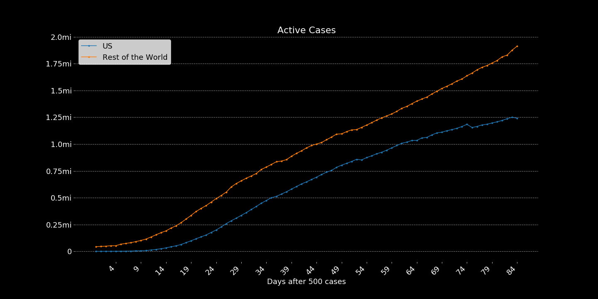 

**Europe:**  
  
  
    
## Severity

COVID-19 patients most commonly display respiratory symptoms; the virus was firstly identified by an outbreak of pneumonia cases, after all. But not only that, the disease has been proved to cause digestive symptoms, cardiovascular damage, neurological manifestations, and others. Most of those symptoms were only registered in a few cases, with even fewer cases developing symptoms hard enough to cause a fatality. [1](https://journals.lww.com/ajg/Documents/COVID_Digestive_Symptoms_AJG_Preproof.pdf), [2](https://www.nature.com/articles/s41569-020-0360-5?fbclid=IwAR3w4wcTno9A798v1fuYbALPLUHU5dNsVNVFKDc6GW-6yED2mXcyxrJY7dc), [3](https://papers.ssrn.com/sol3/papers.cfm?abstract_id=3544840), 
[4](https://www.thelancet.com/journals/langas/article/PIIS2468-1253(20)30057-1/fulltext), [5](https://www.independent.co.uk/news/world/americas/coronavirus-symptoms-lung-kidney-heart-covid-19-us-doctors-a9466701.html?utm_source=reddit.com)  
    
 Mostly the deaths are happening because of respiratory symptoms, with a higher probability of happening to patients in higher age or with pre-existing health conditions. [1](https://www.sciencedirect.com/science/article/pii/S0140673620305663), [2](https://www.youtube.com/watch?v=BuzP-uLctYE)

>The fact that many patients deteriorate to a critical state and require intensive care for significantly more than one week is particularly concerning. Basic epidemiological models of the spread of the SARS-CoV-2 virus suggest that owing to its contagiousness and the lack of immunity in the population, 40−70% of the population could become infected unless strong measures are taken. [Swiss Medical Weekly](https://smw.ch/article/doi/smw.2020.20225?fbclid=IwAR2MDart-7WJ1IotWGBszlmHl6JCSgqVQexw2iPqOlnMvZQ1XSpjsV1PNaY)

On top of all that, we are still trying to figure out much about treatment, the disease is spreading very quickly, and our healthcare resources are limited.
[1](https://youtu.be/bp5RMutCNoI)
  
## Mortality Rates
  
I want to make a note here about the mortality rates. In this analysis, I've used two methods to calculate the on-going mortality rate of the virus, but it's important to mention that both of them are incredibly naive.

The [first way](https://www.worldometers.info/coronavirus/coronavirus-death-rate/#correct) is what most people are doing, merely calculating Deaths/Confirmed Cases and reporting the percentage of people that died from the disease compared to the number of confirmed cases, this is naive because it doesn't consider the 'time'. Most of the confirmed cases are currently infections in process, that hasn't concluded yet, so by considering them we are reducing the actual mortality rate.  
  
The [other method](https://academic.oup.com/aje/article/162/5/479/82647) I'm using is calculating Deaths/(Deaths+Recoveries), this way we're considering only cases that concluded. But again, this is still incomplete since, at the beginning of the pandemic, the only cases reported were cases with troublesome symptoms and mostly in late stages of the infection. The number of deaths was reported way faster than the recoveries, and we took a long time until we started looking at asymptomatic cases. So this number will usually display a higher mortality rate than the true.  
  
To make it simple, consider the top line, you see as an overestimated mortality rate and the bottom as an underestimated rate.   
  
**Countries with most confirmed cases:**  
  

  
**Relatively Successful countries:**  
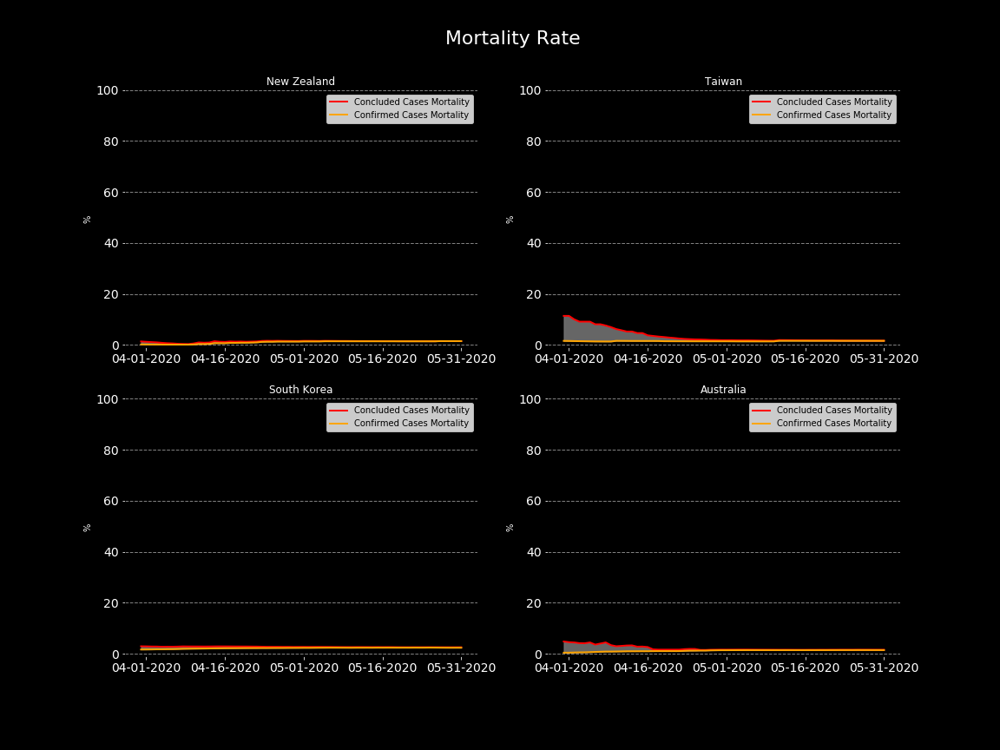  
 
    
_____

## Treatment
  
According to recommendations from WHO, the COVID-19 has mostly been treated as other viral cases of pneumonia, with ARDS management and respiratory support.  
Not different from the other topics discussed so far, this has also been a target of misinformation, lots of talks around treatments, ventilators, respirators, medicines, and so on.  
  
In this topic, most of the misinformation is being able to spread from the lack of knowledge in the medical community. The recommended treatment proposed by WHO is not working in many cases, there are lots of hospitals trying different procedures and methods to control the symptoms, but still, there is a huge lack of properly conducted studies, so most of the results can't be properly reproduced by other hospitals. [1](https://www.youtube.com/watch?v=bp5RMutCNoI), [2](https://www.sciencedirect.com/science/article/pii/S0924857920300996), [3](https://www.medrxiv.org/content/10.1101/2020.04.10.20060699v1), [4](https://www.thelancet.com/action/showPdf?pii=S1473-3099%2820%2930132-8)  
  
We should understand that those clinical trials are required for safe reproduction of the treatment, and most importantly, that those results should be analyzed by doctors who will make their decisions on how to apply them. In therapeutics, for example, even without the proper results, many medications are being boosted as "cures" by politicians and the media, and this is extremely dangerous and can bear heavy consequences. [1](https://www.sciencemag.org/news/2020/03/insane-many-scientists-lament-trump-s-embrace-risky-malaria-drugs-coronavirus), [2](https://www1.folha.uol.com.br/internacional/en/brazil/2020/04/bolsonaro-defends-chloroquine-and-resumes-clash-with-governors-and-mayors-in-televised-speech.shtml)  

Journal of the American College of Emergency Physicians Open. April 7, 2020:  
  
[source](https://onlinelibrary.wiley.com/doi/epdf/10.1002/emp2.12081)  

Even though those tests will take a long time until properly concluded, peer-reviewed, and reproduced in other facilities, they are essential. Only by adequately documenting what was proven to work, we can prepare for the next waves of spread, de-isolation, and re-opening of the economy in many places.  
  
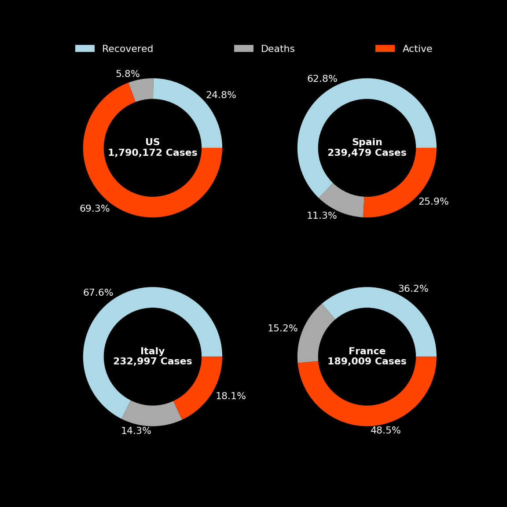    
  
  
_____  
  
## Suppression and Mitigation

The impacts on our society will take decades to repair. Deaths, traumas, low morale of citizens and a struggling economy are expected to follow the virus. To contain these effects, we need to work on mitigation measures, those measures are being taken around the world in the most different shapes and forms, but what works in a situation like this?  
  
**Fiscal Responses** taken by some major economies, according to [Bruegel](https://www.bruegel.org/publications/datasets/covid-national-dataset/):  
  

One thing is clear: doing nothing isn't helpful in anyways and will cause an even higher impact on society and its economy.[1](https://www.thelancet.com/pdfs/journals/lancet/PIIS0140-6736(20)30567-5.pdf) 
  
> "Until an efficacious and safe vaccine becomes available − with even the most optimistic estimates putting this at 9 to 18 months − the only way to prevent the above scenario[*](#Severity) is to control the spread of SARS-CoV-2. While strict social distancing measures are necessary, nobody can imagine such measures being enforceable for extended periods" [Swiss Medical Weekly](https://smw.ch/article/doi/smw.2020.20225?fbclid=IwAR2MDart-7WJ1IotWGBszlmHl6JCSgqVQexw2iPqOlnMvZQ1XSpjsV1PNaY)  
  
The [Imperial College COVID-19 Response Team](https://spiral.imperial.ac.uk/bitstream/10044/1/77482/8/2020-03-16-COVID19-Report-9.pdf) has described a nice categorization of the measures taken by countries and regions, where they are either going for suppression or mitigation measures. Both solutions require extensive use of non-pharmaceutical interventions (NPIs), which comes to proper hygiene, social distancing, and others solutions intended to reduce transmission.  

>**Suppression**. Here the aim is to reduce the reproduction number (the average number of secondary cases each case generates), R, to below 1 and hence to reduce case numbers to low levels or (as for SARS or Ebola) eliminate human-to-human transmission. The main challenge of this approach is that NPIs (and drugs, if available) need to be maintained – at least intermittently - for as long as the virus is circulating in the human population, or until a vaccine becomes available. In the case of COVID-19, it will be at least 12-18 months before a vaccine is available. Furthermore, there is no guarantee that initial vaccines will have high efficacy

>**Mitigation**. Here the aim is to use NPIs (and vaccines or drugs, if available) not to interrupt transmission completely, but to reduce the health impact of an epidemic, akin to the strategy adopted by some US cities in 1918, and by the world more generally in the 1957, 1968 and 2009 influenza pandemics. In the 2009 pandemic, for instance, early supplies of vaccine were targeted at individuals with pre-existing medical conditions which put them at risk of more severe disease. In this scenario, population immunity builds up through the epidemic, leading to an eventual rapid decline in case numbers and transmission dropping to low levels.  
  
Both paths will lead to tremendous losses, by the actions we're watching from other countries, we can note that mitigation measures only work with a highly efficient structure, and when adopted in the early stages of the contamination, those were seen in South Korea, Taiwan, and Singapore. While some countries failed to maintain mitigation measures such as the UK, others barely had time to it, such as Italy, France, and Spain. Those countries that couldn't handle the situation with mitigation measures quickly pursued suppression measures, with tighter restrictions on the population and limitations to movement, commerce, and production of "non-essential" goods.  
  
**Italy** is trying to contain the outbreak with wide suppression measures, NPIs, and testing:  
  
  
Methods such as **case isolation and contact tracing** can be beneficial, especially if done at the start of the spread. The idea here is to isolate cases and track the individuals who were in contact with the hosts for further testing, isolating, tracing their contacts, and so on. Still, as the infection goes undetected, it gets harder to contain it through contact tracing. [1](https://www.sciencedirect.com/science/article/pii/S2214109X20300747)
  
**South Korea** is containing the infections with targeted and clustered isolations, lots of testing, social distancing, and NPIs.  
  
  
Some even more expensive measures, such as testing a local population and isolating asymptomatic cases, were already tested and also proved to help contain the virus. Unfortunately, the resources needed to provide such an amount of testing may be too far from reality to many places.    
  
>In an open letter to the authorities in the Tuscany region,1 Romagnani wrote that the great majority of people infected with COVID-19—50-75%—were asymptomatic, but represented "a formidable source" of contagion. [The BMJ](https://www.regenhealthsolutions.info/wp-content/uploads/2020/04/Covid-19-identifying-and-isolating-asymptomatic.pdf)

A tough decision when working with targeted isolation or any other kind of movement restriction is when to stop? Since there isn't a test reliable enough to decide on de-isolation, many factors need consideration, and those can be even harder when we account for asymptomatic cases, dual infections, and other issues imposed by the scalability of collecting those indicators.  
  
> "No single indicator may be effectively used to decide on the de-isolation of a suspect case. In our series of positive cases, samples from one suspect case only returned positive on the fifth repeated sample (nasopharyngeal swab), on the seventh day of clinical illness. Current evidence suggests that transmission of COVID-19 may be possible even from asymptomatic contacts, and polymerase chain reaction (PCR) testing may not return positive initially." [National Centre for Infectious
Diseases - Singapore](https://www.med.uminho.pt/pt/covid19/Sade%20Pblica/Tay-2020-De-isolating%20COVID-19%20Suspect%20Cases_.pdf)
  
**World-wide** lockdown measures, inspired by [this](https://www.businessinsider.com/countries-on-lockdown-coronavirus-italy-2020-3#china-implemented-what-was-then-the-largest-quarantine-in-human-history-to-try-to-contain-the-coronavirus-locking-down-at-least-16-cities-at-the-end-of-january-14) Business Insider article  
  
  
>“We know that Covid-19 spreads fast and we know that it is deadly – ten times deadlier than the 2009 flu pandemic. We know that the virus can spread more easily in crowded environments like nursing homes. We know that early case finding, testing, isolating, caring for every case, and tracing every contact is essential for stopping transmission." [WHO](https://www.independent.co.uk/news/health/coronavirus-deaths-cases-latest-swine-flu-who-a9462896.html?utm_source=reddit.com)  

# Testing  

It's undeniable that high amounts of testing are necessary to both suppress and to maintain control of the virus once contained. They're also how most countries are confirming cases, so it's essential to understand how to interpret their results.

    Error Type I > False Positive > Testing positive without having the virus.
    Error Type II > False Negative > Testing negative while having the virus.

**Testing Numbers:**
Testing is reported in many different ways, if reported at all. 
Within [this dataset](https://github.com/owid/covid-19-data), they are reported either by the number of people/ cases tested or the amount of tests/ swabs/ samples. In my understanding, people may be tested more than once, especially if they test positive, this may cause a significant difference when comparing those numbers.  
  
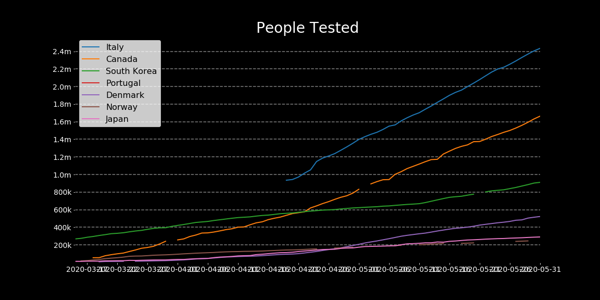  
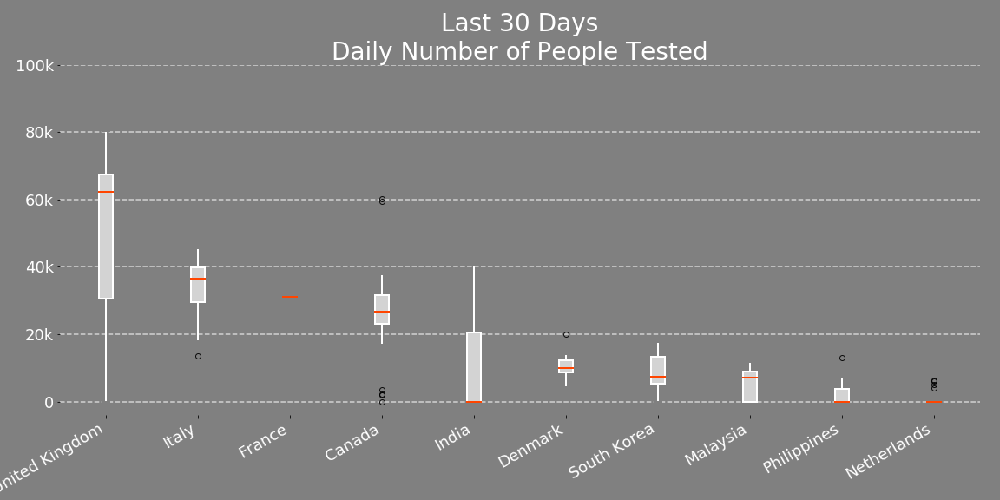   
  
  
  
_____
# Regressions

Those regressions are based on the work compiled by [Xingyu Bian](https://www.kaggle.com/therealcyberlord/coronavirus-covid-19-visualization-prediction).  
  
It's essential to make a few notes about regressions and predictions at this time. Those numbers are for illustration and research only. They should never replace any kind of medical or governmental information you may receive. It's also important to note that the integrity of the analyzed data is questionable, so predictions may have a significant distortion when compared to reality.
  
**SVM - Support Vector Machine Regressor:**  
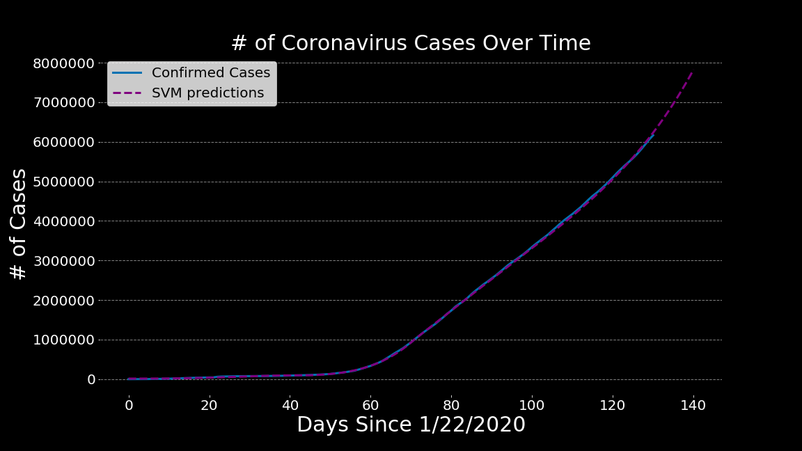  
    
  
**Polynomial Regression:**  
  
  
  
**Polynomial Bayesian Ridge Regression:**  
  
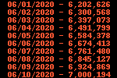  
  
_____
# Patients Info 

Three small samples of patients were used for building the following visualizations. [1](https://www.kaggle.com/kimjihoo/coronavirusdataset), [2](https://www.kaggle.com/roche-data-science-coalition/uncover), [3](https://github.com/ishaberry/Covid19Canada).  
It's Important to mention the results displayed by those distributions depend on many factors, and this distribution only represents a random sample of patients at random times and hospitals. Things like the kind of treatment, age, pre-existing health conditions, and many others will directly affect those numbers. So by any means, this should be considered current or accurate.  
  
Age Distribution - All Patients  
  
  
Age Distribution - Released Patients  
  
  
Histogram of patients by days until release  
(days between confirmed case and release)  
  
    

Histogram of patients by days until fatality  
(days between the confirmed case and deceased date)  

  
_____

# Notes about Countries

**United States** is currently the country with most cases, it started to accumulate cases soon but only recognized the problem on the late march when the many epidemics spread trough the country couldn't be contained anymore. Most of the mistakes the US committed were due to poor leadership and denialism of what was happening. They then realized the impacts this crisis will bring to the economy and began to test and prepare for the on-going spread.  
  
[Trump Tweet](https://i.imgur.com/e6JNRGi.png)  
[Trump on COVID-19](https://twitter.com/i/status/1242193904553865216)  
[NY - End of March](https://www.youtube.com/watch?v=bE68xVXf8Kw)  
[U.S. reluctant to call national lockdown](https://youtu.be/L1XIXssA1xg)  
[Economic Stimulus](https://www.nytimes.com/2020/03/26/business/economy/fed-coronavirus-stimulus.html)  
  
**U.S. and the World:**  
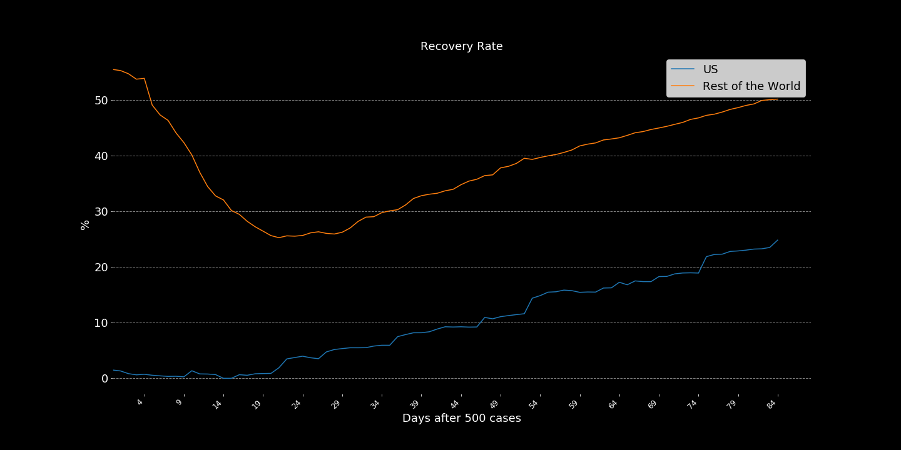  

**China** is the epicentre of the disease, where it originated and started spreading. It has been keeping a bad record of the epidemic, with [misleading data](https://www.forbes.com/sites/kenrapoza/2020/03/31/china-hints-that-its-coronavirus-data-doesnt-paint-full-picture/#59d700422d58), reluctancy to accept the situation and [poor handling of the medical team](https://www.theguardian.com/world/2020/mar/11/coronavirus-wuhan-doctor-ai-fen-speaks-out-against-authorities) that both discovered and were treating the pandemic. In addition to that, at the start of the epidemic [WHO supported China](https://nationalpost.com/news/world/this-is-not-a-time-for-fear-who-downplays-criticism-china-hushed-up-coronavirus-in-early-days) by [holding information](https://www.cnbc.com/2020/04/01/coronavirus-china-hid-extent-of-outbreak-us-intelligence-reportedly-says.html?view=story) and [delaying world efforts](https://www.youtube.com/watch?v=m5fsidSOJMw), [ensuring other nations](https://www.youtube.com/watch?v=LwqhvRcBrK4) that China was doing a great job containing the virus. This series of [misleading actions](https://www.youtube.com/watch?v=KjXR4o2EFYI) and [grave mistakes](https://www.youtube.com/watch?v=U-746eJGyUI&feature=youtu.be) led to worldwide spread.  
  
  
  
[Late Asymptomatic Cases Reporting](https://www.cnn.com/2020/03/31/asia/china-asymptomatic-coronavirus-cases/index.html)  
  
After all those issues and due to the situation we are now, it's clear that the World Health Organization shouldn't be so [politized](https://www.youtube.com/watch?v=UlCYFh8U2xM).
  
**South Korea** is an example of how to [deal properly](https://www.youtube.com/watch?v=BE-cA4UK07c&feature=youtu.be) with the epidemic and has a excellent record of transparent release of data and information.  
[SK Testing](https://external-preview.redd.it/0rInwaK8upOHByAw_vSrRzdbddmOHwIfZcPmFkLMdIw.jpg?width=640&crop=smart&auto=webp&s=f6413e0eefe6f58f564261d05c56cddea44f10fe)  
[Only 8 new cases, April-19](https://en.yna.co.kr/view/AEN20200419001400320)  

**Iran** has also started in a denialist path, and tried to change the narrative but still is having lots of problems involving religious and scientific conflicts inflated by misinformation campaigns during the pandemic. Their data on recoveries and active cases looks optimistic but is considered by many unrealistic. 
  
[CBC Coverage](https://www.youtube.com/watch?v=_4Bt29_-oFw)  
[NY Times Coverage](https://www.youtube.com/watch?v=lm2UFynetJw)  
  
Active cases after 500 cases, China, SK, and Iran:  
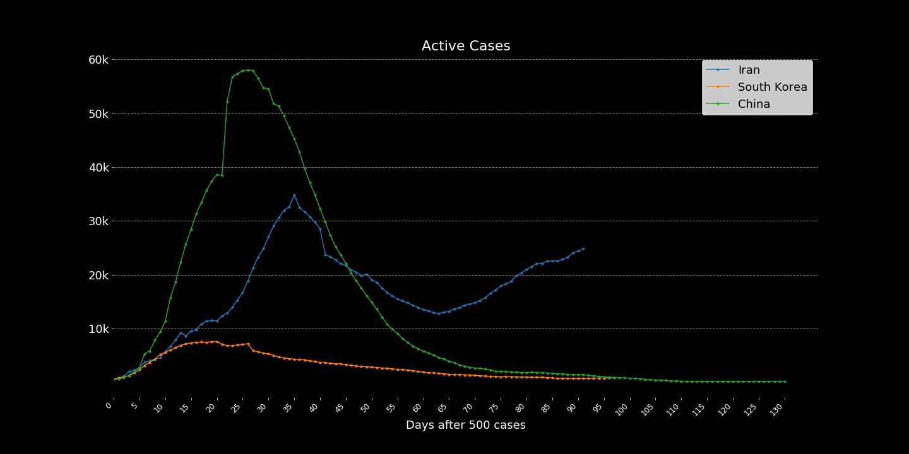  
  
**United Kingdom** was reluctant to start preparations and enforce containment measures at the beginning of the crisis, they considered [herd-immunity](https://www.youtube.com/watch?v=hJBTV8anp-8) as an option but eventually recognized their mistakes and started a [nationwide lockdown](https://www.youtube.com/watch?v=LlJIwTd9fqI) 4 days before announcing the [PM has tested positive](https://www.cbc.ca/news/world/britain-pm-johnson-covid-19-1.5512020) for the virus. Their current situation is not looking good. They had also experienced a lack of resources, more specifically of [tests](https://www.youtube.com/watch?v=96_4FfXA94c).  

**Italy** was the second country to have extremely high numbers of infections. It started after China's lockdown and quarantine procedures. Since they were the second country to be heavily hit, their healthcare system [wasn't expecting](https://www.who.int/dg/speeches/detail/who-director-general-s-statement-on-the-advice-of-the-ihr-emergency-committee-on-novel-coronavirus) it to be so fast, they [couldn't handle the situation](https://www.youtube.com/watch?v=z2KpsZRpoZ8) and were quickly overwhelmed by cases. Italy was, for some time, the country with the most registered casualties and motivated most of the world to act in preparation for the COVID-19 pandemic.  
  
**Spain** was heavily hit with the virus shortly after Italy, and they are currently the second country with most cases of the disease. They have been struggling with resource shortages, and the overflow of infected patients have [reportedly](https://www.youtube.com/watch?v=i4DngwmTzIA) overwhelmed their systems.  
  
**Germany** has been [keeping control](https://www.youtube.com/watch?v=TC8wxecpcfk) of the situation as well as [it can](https://www.theguardian.com/world/2020/apr/16/angela-merkel-draws-on-science-background-in-covid-19-explainer-lockdown-exit). It was one of the few countries to take [patients from other countries](https://www.foxnews.com/world/germany-takes-coronavirus-patients-from-italy) for treatment and have worked mostly with mitigation methods.  
  
**France** has suffered a lot with the pandemic already, like Italy, they were one of the first countries to be infected. Due to poor preparation and a [delay in taking actions](https://www.thelancet.com/journals/lanpub/article/PIIS2468-2667(20)30087-6/fulltext) against the contamination, they've seen huge numbers of infected with high mortality rates.  
  
**Canada**  is treating the pandemic seriously since the beginning. Even though there's no national lockdown and most measures taken so far were for mitigation, its response has resulted in a reasonable detection rate (testing/ confirmed), a notable amount of recoveries, and excellent public cooperation. The country has overall shown a [single direction](https://www.youtube.com/watch?v=q2vsNuZ4_Zg) in matters of dealing with the virus. Still, the size of the crisis and its responses are different in every province, Quebec, for example, is suffering a lot with the infection.  

Cases overview:  
  
  
  
  
_British Columbia:_  

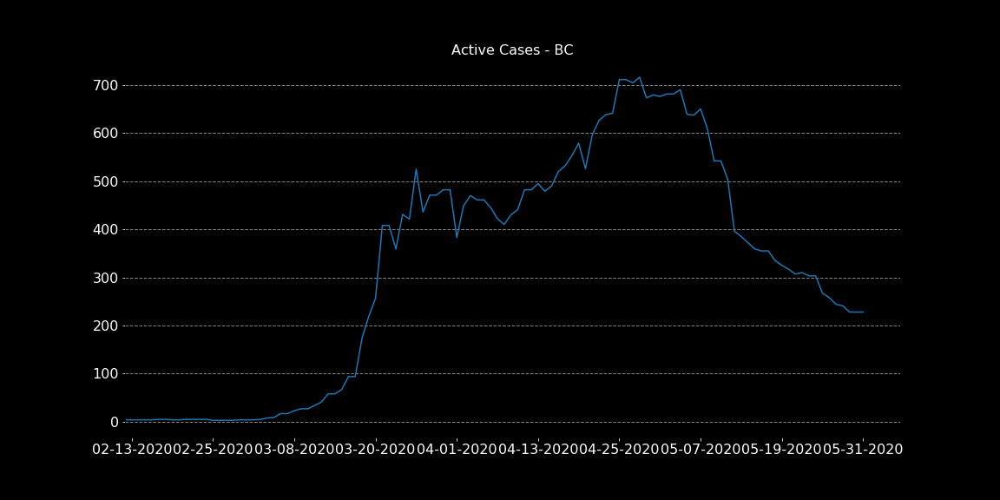  
  
Canada Cases/ Population:  
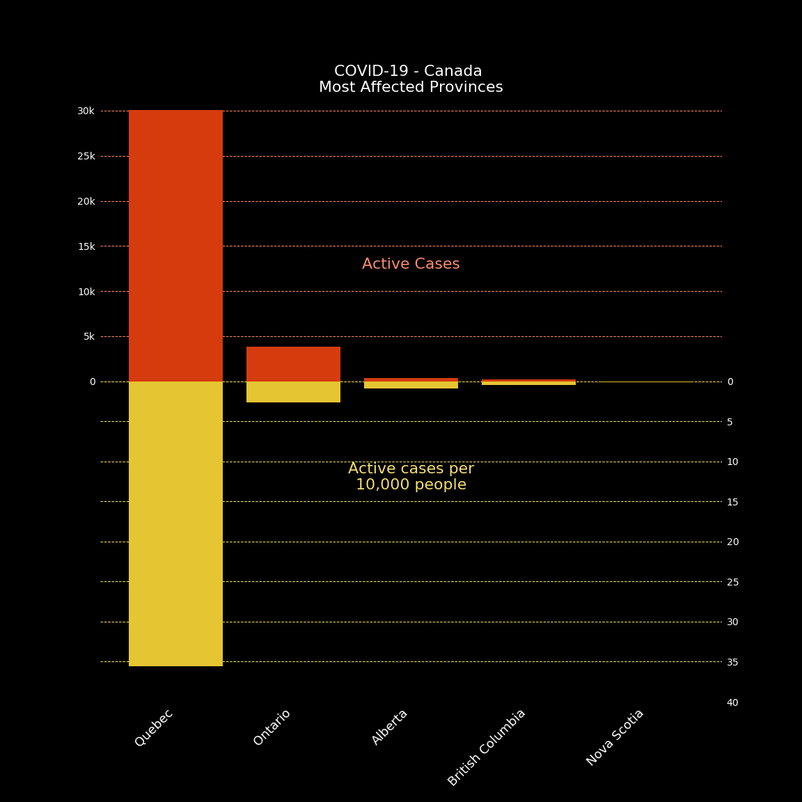  
  
**Brazil**'s position has been unclear since [the president is dismissing](https://www.nytimes.com/2020/04/01/world/americas/brazil-bolsonaro-coronavirus.html) the pandemic. Still, other political leaders are not, Brazil also has issues within its data collection, mostly for lack of testing. Hence, the information is not entirely trustworthy.  
  
[Health Minister Fired](https://www.huffingtonpost.ca/entry/bolsonaro-coronavirus-brazil-mandetta_n_5e97778bc5b6ead140070f6e?ri18n=true)  
[Homeless People Risks](https://www.youtube.com/watch?v=IbgUe-YmM-E)  
  
Brazil and Canada:  
**Overall**  
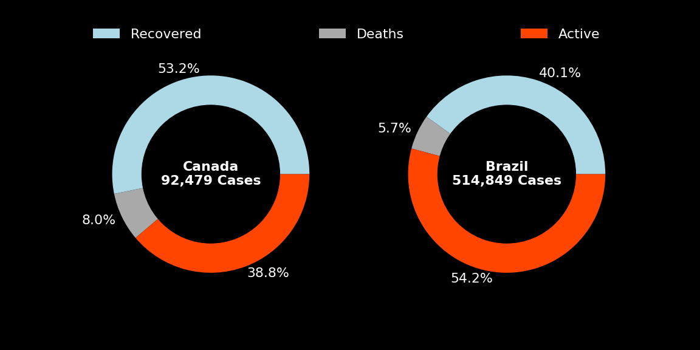    
**Timeseries**  
  
  
**Mortality**  
  

  
**Cuba**, even with lack of resources, limited housing and space, which makes social distancing harder. Is being extremely helpful by [rescuing infected passangers](https://www.independent.co.uk/news/world/americas/coronavirus-cruise-ship-cuba-rescue-ms-braemar-havana-cases-a9451741.html) of cruise ships, and [sending doctors](https://apnews.com/98cfdbf5c4a62a40eba648723e452f3e) to overwhelmed countries. It's important to note that they were one of the few countries that started preparing for the pandemic in January.   
  
# Who is WHO?

The World Health (WHO), was constituted in 1948 to coordinate health affairs for the United Nations.

Today, they already have more than 7000 people working in 150 country offices, working in a shared commitment to achieving better health for everyone, everywhere.    
  
They've already helped a lot with diseases such as Malaria, Influenza, Polio, HIV, Cancer, and so on.  
  
Now, they're receiving a lot of attention with the pandemic since one of their responsibilities is to support it's 194 member countries containing the COVID-19. We must note that the way they're supposed to help those countries is by outlining guidelines, overviewing progress, and sharing knowledge with its members. WHO is not responsible for actually sending doctors, equipment, or developing therapeutics.  
  
Top 10 Assessed Donors 2020-2021:
  

## Appreciation  
  
Since I'm publishing these notes, I want to recognize how much WHO has done for all of us. I cannot stress how much the job they do is essential, they are an irreplaceable organization, and we would be in a way worse situation in this pandemic if it weren't for them.  
  
[Polio Eradication - Map](https://imgur.com/a/MnThKJW), [GIT](https://github.com/Thiagobc23/Polio)  
  
Top 20 Voluntary Donors 2017:  
  

My comments may sound harsh, but even though WHO has done a lot for all of us, there's still a lot of room for improvement and transparency.  

# And what now?

So the situation is dire, the virus is deadly enough to cause tremendous damage in our society, but it's also mild enough to spread undetected, our globalist supply chains are in danger, and global production is about to enter a falling trend, there is no known therapeutics or treatments that can alleviate the healthcare system, and testing is not as available as it should. So what can we do to help? How should the communities be acting now? And what to expect for the future?  
  
First of all, the focus now should be on containment, so we can buy time to develop some kind of deterrent for the spread, this means social distancing, lockdowns, hygiene campaigns, and lots and lots of cooperation.  
  
The second objective should be supplying and improve our current healthcare systems, and this is even harder than the first. We need increased test capacity, more beds, more medical equipment, more PPE, and, most importantly, more trained healthcare professionals. This point is not just important for what's going on now, but also for the future. If there are more waves of spread, we must be prepared.  
  
Third would be to work on long term solutions, vaccines are optimistically expected in 18 months, but we know that the fastest we ever took to develop, test and massively produce one was five years.  
  
  
[source](https://www.gatesnotes.com/Health/What-you-need-to-know-about-the-COVID-19-vaccine?WT.mc_id=20200430100000_COVID-19-vaccine_BG-EM_&WT.tsrc=BGEM)   
  
Efficiency will also be a very important indicator once the vaccines trials start collecting enough data, for reference the current influenza vaccine has about [45% efficiency](https://www.cdc.gov/mmwr/volumes/69/wr/mm6907a1.htm).

New therapeutics may take even longer for development. Still, the already approved ones, used for other diseases, may have benefits in controlling the severity of COVID-19, and we could see something in the next 6~12 months. The same goes for different treatments and NPIs.  
  
Only after effectively controlling the disease, we can start to think about economic growth. Bill Gates has explained it very well in a [TED interview](https://www.youtube.com/watch?v=Xe8fIjxicoo).

>It's very tough to say to people, "Hey, keep going to restaurants," you know, "Go buy new houses, ignore that pile of bodies over in the corner, just, you know, we want you to keep spending" because there's some, maybe a politician who thinks GDP growth is what really counts. [Bill Gates]
  

I want to add a section about the economy in this project, but for now, I don't have enough information to write an educated opinion; many countries haven't published their updated unemployment numbers, or estimates for GDP, etc...  
  
_____
# References, resources, and inspirations.  
    
[Daily Cases and Reports - by Johns Hopkins CSSE](https://github.com/CSSEGISandData/COVID-19)  
[CBC News Articles Dataset](https://www.kaggle.com/ryanxjhan/cbc-news-coronavirus-articles-march-26)  
[Data Science for Covid-19 - South Korea Data](https://www.kaggle.com/kimjihoo/coronavirusdataset)  
[Covid19 - Canada](https://github.com/ishaberry/Covid19Canada)  
[Daily Cases Report](https://www.kaggle.com/imdevskp/corona-virus-report)  
[World Bank - Health Systems](https://www.kaggle.com/danevans/world-bank-wdi-212-health-systems)  
[Roche DS Coalition - Uncover Challange](https://www.kaggle.com/roche-data-science-coalition/uncover#public-covid-19-cases-canada.csv)  
Forecast competition [w1](https://www.kaggle.com/c/covid19-global-forecasting-week-1), [w2](https://www.kaggle.com/c/covid19-global-forecasting-week-2)  
[Research Papers](https://www.kaggle.com/allen-institute-for-ai/CORD-19-research-challenge/)  
[Italy Cases](https://www.kaggle.com/sudalairajkumar/covid19-in-italy)  
[Wellcome Survey (2018)](https://wellcome.ac.uk/reports/wellcome-global-monitor/2018)  
[CBC article on data sharing](https://www.cbc.ca/news/canada/coronavirus-date-information-sharing-1.5500709)  
[Singapore Dashboard](https://co.vid19.sg/singapore/dashboard)  
[Canada Dashboard](https://resources-covid19canada.hub.arcgis.com/)    
[The international journal of science / 19 March 2020](https://media.nature.com/original/magazine-assets/d41586-020-00772-4/d41586-020-00772-4.pdf)  
[Economics in the Time of COVID-19](http://viet-studies.net/kinhte/COVID19_CPER.pdf), edited by Richard Baldwin and Beatrice Weder di Mauro.  
[Economic Strategy Group Statement - COVID-19](https://economicstrategygroup.org/resource/economic-strategy-group-statement-covid19/)  
[Fiscal response to the economic fallout](https://www.bruegel.org/publications/datasets/covid-national-dataset/)  
WHO funding: [1](https://www.who.int/about/finances-accountability/funding/assessed-contributions/en/), 
[2](https://www.who.int/images/default-source/infographics/budget/top-20.jpg), 
[3](https://www.who.int/about/finances-accountability/funding/A71_INF2-en.pdf?ua=1)  
[SEIR Modeling - Git](https://gabgoh.github.io/COVID/index.html)  
[OWID](https://github.com/owid/covid-19-data)  
  
Video Resources:  
[Cambridge University: Spanish Flu: a warning from history - 2018](https://www.youtube.com/watch?v=3x1aLAw_xkY)  
[Cambridge University: Coronavirus Vaccine](https://youtu.be/UPkVbZ9X_jQ)  
[Lessons from 1918 flu - Laurie Garrett](https://www.ted.com/talks/laurie_garrett_lessons_from_the_1918_flu?utm_campaign=tedspread&utm_medium=referral&utm_source=tedcomshare)  
[Bill Gates: TED Talk, Next Outbreak - 2015](https://www.youtube.com/watch?v=6Af6b_wyiwI)  
[Global Economy Impact - Al Jazeera](https://www.youtube.com/watch?v=94wGHRDHyHo)  
  
### More Info About this Project:
For now, I'm just collecting and analyzing data. As things are way too fast, I'm not adequately documenting my code, but I do plan to return and fix this :)